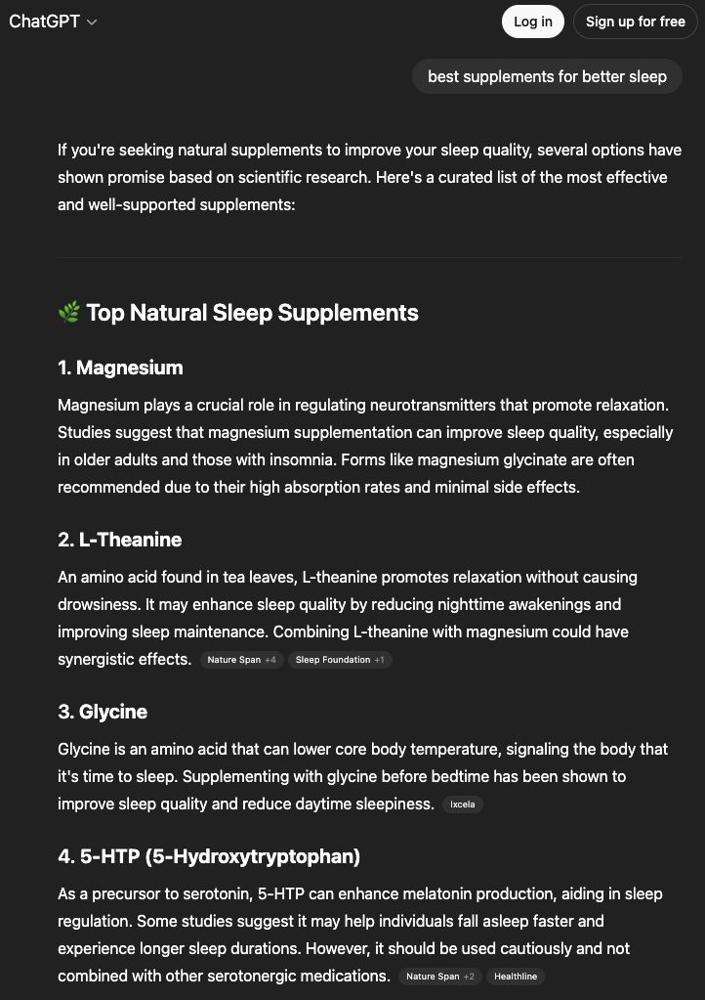

# ChatGPT Scraper

[](https://oxylabs.io/products/scraper-api/serp/chatgpt?utm_source=877&utm_medium=affiliate&groupid=877&utm_content=chatgpt-scraper-github&transaction_id=102f49063ab94276ae8f116d224b67)

[](https://discord.gg/GbxmdGhZjq)

The [ChatGPT Scraper](https://oxylabs.io/products/scraper-api/serp/chatgpt) by Oxylabs allows you to send prompts to ChatGPT and automatically collect both conversational responses and structured metadata. You can use the [Web Scraper API](https://oxylabs.io/products/scraper-api) with ChatGPT for SEO monitoring, AI response analysis, and brand presence tracking. It provides parsed, ready-to-use JSON output without the need to manage proxies and browsers, or avoid anti-bot systems.


## How it works

You can gather ChatGPT scraper response results by simply providing a prompt and valid Web Scraper API credentials. Once authenticated, you can make a simple POST request to the API as shown below.

### Request sample (Python)

```python
import requests
from pprint import pprint

# Structure payload
payload = {
    'source': 'chatgpt',
    'prompt': 'best supplements for better sleep',
    'parse': True,
    'search': True,
    'geo_location': 'United States'
}

# Get response
response = requests.request(
    'POST',
    'https://realtime.oxylabs.io/v1/queries',
    auth=('USERNAME', 'PASSWORD'),
    json=payload,
)
# Print prettified response
pprint(response.json())
```
You can find code examples for other programming languages [**here**](https://github.com/oxylabs/chatgpt-scraper/tree/main/Code%20examples).


### Request parameters

| Parameter          | Description                                        | Default Value |
|--------------------|----------------------------------------------------|---------------|
| `source` (mandatory) | Sets the ChatGPT scraper.                                  | `chatgpt`       |
| `prompt` (mandatory) | The input prompt to submit (max 4000 characters).  | –             |
| `search`             | Trigger ChatGPT web search for the prompt.         | `true`          |
| `geo_location`       | Specify a country to send the prompt from.         | –             |
| `render`             | JavaScript rendering is enforced by default for `chatgpt`. | –     |
| `parse`              | Return parsed structured data.                     | `true`          |
| `callback_url`       | URL for asynchronous callbacks.                    | –             |


### Output samples

**HTML example:**



This is a structured JSON snippet of the response output:

```json
{
    "results": [
        {
            "content": {
                "prompt": "best supplements for better sleep",
                "llm_model": "gpt-4o",
                "markdown_json": ["json here"],
                "markdown_text": "Improving sleep through supplements...",
                "response_text": "Improving sleep through supplements...",
                "parse_status_code": 12000
            },
            "created_at": "2025-07-21 09:44:41",
            "updated_at": "2025-07-21 09:45:17",
            "page": 1,
            "url": "https://chatgpt.com/?hints=search",
            "job_id": "7352996936896485377",
            "is_render_forced": false,
            "status_code": 200,
            "parser_type": "chatgpt",
            "parser_preset": null
        }
    ]
}
```
You can find the full [output example file](output-chatgpt-scraper.json) in this repository.

Alternatively, you can extract the data in the Markdown format for easier data integration workflows involving AI tools.

**Note:** The composition of elements may vary depending on whether the query was made from a desktop or mobile device.


### JSON output structure

This is the detailed list of each element that ChatGPT Web Scraper API parses, including descriptions, data types, and relevant metadata.  

**Note:** The number of items and fields for a specific result type may vary depending on the submitted prompt.

| Key Name                 | Description                                                   | Type      |
|---------------------------|---------------------------------------------------------------|-----------|
| `url`                       | The URL of ChatGPT conversation.                              | string    |
| `page`                      | Page number.                                                 | integer   |
| `content`                   | An object containing the parsed ChatGPT response data.        | object    |
| `content.prompt`            | Original prompt submitted to ChatGPT.                         | string    |
| `content.llm_model`         | ChatGPT model used (e.g., "gpt-4-o", "gpt-3.5-turbo", etc.).  | string    |
| `content.markdown_json`     | Parsed response in JSON markdown format.                      | array     |
| `content.markdown_text`     | Parsed response in plain markdown text.                       | string    |
| `content.response_text`     | Complete response text from ChatGPT.                          | string    |
| `content.citations`         | List of citation links with URL and text.                     | array     |
| `content.links`             | List of external links referenced in the response.            | array     |
| `content.parse_status_code` | Status code of the parsing operation.                         | integer   |
| `created_at`                | Timestamp when the scraping job was created.                  | timestamp |
| `updated_at`                | Timestamp when the scraping job was finished.                 | timestamp |
| `job_id`                    | ID of the job associated with the scraping job.               | string    |
| `geo_location`              | Proxy location from which the prompt was submitted.           | string    |
| `status_code`               | Status code of the scraping job. See the full [status code list](https://developers.oxylabs.io/scraping-solutions/web-scraper-api/response-codes). | integer   |
| `parser_type`               | Type of the parser used for breaking down the HTML content.   | string    |


## Practical use cases

This ChatGPT scraper API opens a wide range of opportunities for developers and data-focused teams.

1. **Building AI training datasets:** Collect diverse, real-world conversational data at scale for training or fine-tuning Large Language Models (LLMs).  
2. **SEO & competitor analysis:** Monitor how competitors' brands and keywords are represented in AI-generated search results.  
3. **Brand presence management:** Track your brand mentions and content rankings to optimize your visibility strategies.  


## Why choose Oxylabs?

- **Maintenance-free:** Our API handles all the infrastructure, from proxy management to IP rotation and anti-bot systems. This means you don't need to spend engineering time on maintenance or adapting to website changes.  
- **High success rates:** Built on our industry-leading infrastructure, the API ensures a high degree of reliability and a consistent data flow for all your scraping tasks.  
- **Advanced features:** The API utilizes a headless browser to mimic real user behavior, automatically bypasses CAPTCHAs, and offers geo-targeting to retrieve localized responses.  


## FAQ

### Is scraping ChatGPT legal?  
The legality of using ChatGPT scrapers depends on the way it is done and the applicable jurisdiction. While Oxylabs provides the infrastructure to collect publicly available or user-submitted data from ChatGPT, it is the responsibility of the user to ensure compliance with OpenAI’s Terms of Service and local regulations.  

### What’s the ChatGPT prompt size limit?  
The maximum prompt length supported by the ChatGPT Scraper is 4,000 symbols. If your use case requires handling longer inputs, consider splitting the text into smaller chunks and sending multiple sequential requests.  


## Learn more

For a deeper dive into available parameters, advanced integrations, and additional examples, check out the [ChatGPT Scraper documentation](https://developers.oxylabs.io/scraping-solutions/web-scraper-api/targets/chatgpt).


## Contact us

If you have questions or need support, reach out to us at **hello@oxylabs.io** or through our [live chat](https://oxylabs.drift.click/oxybot).
