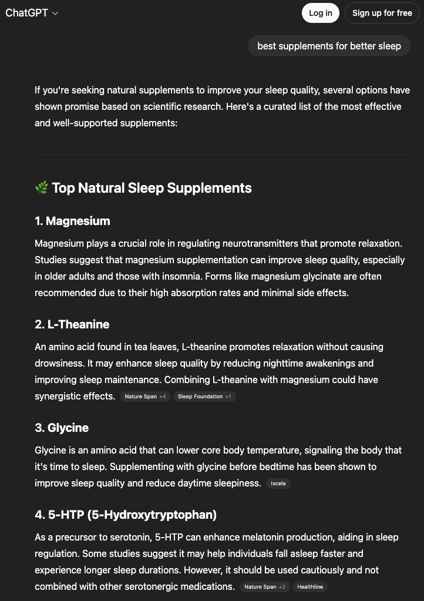

# ChatGPT Scraper

[](https://oxylabs.io/products/scraper-api/serp/chatgpt?utm_source=877&utm_medium=affiliate&utm_campaign=llm_scrapers&groupid=877&utm_content=chatgpt-scraper-github&transaction_id=102f49063ab94276ae8f116d224b67)

[](https://discord.gg/Pds3gBmKMH) [](https://www.youtube.com/@oxylabs)

The [ChatGPT Scraper](https://oxylabs.io/products/scraper-api/serp/chatgpt) by Oxylabs allows you to send prompts to ChatGPT and automatically collect both conversational responses and structured metadata. You can use the [Web Scraper API](https://oxylabs.io/products/scraper-api) with ChatGPT for SEO monitoring, AI response analysis, and brand presence tracking. It provides parsed, ready-to-use JSON output without the need to manage proxies and browsers, or avoid anti-bot systems.


## How it works

You can gather ChatGPT scraper response results by simply providing a prompt and valid Web Scraper API credentials. Once authenticated, you can make a simple POST request to the API as shown below.

> [!TIP]
> Get a free trial of Oxylabs **Web Scraper API** by registering on the [Dashboard](https://dashboard.oxylabs.io/en/registration).

### Request sample (Python)

```python
import requests
from pprint import pprint

# Structure payload
payload = {
    'source': 'chatgpt',
    'prompt': 'best supplements for better sleep',
    'parse': True,
    'search': True,
    'geo_location': 'United States'
}

# Get response
response = requests.request(
    'POST',
    'https://realtime.oxylabs.io/v1/queries',
    auth=('USERNAME', 'PASSWORD'),
    json=payload,
)
# Print prettified response
pprint(response.json())
```
You can find code examples for other programming languages [**here**](https://github.com/oxylabs/chatgpt-scraper/tree/main/Code%20examples).


### Request parameters

| Parameter          | Description                                        | Default Value |
|--------------------|----------------------------------------------------|---------------|
| `source` (mandatory) | Sets the scraper target. Use `chatgpt`.            | –             |
| `prompt` (mandatory) | Promp to ChatGPT (max 4000 characters). | – |
| `search`             | Set to true for web search.                        | `false`       |
| `geo_location`       | Specify a country to route the request from.       | –             |
| `parse`              | Set to `true` for structured JSON results.            | `false`       |
| `callback_url`       | URL to your callback endpoint.                     | –             |


### Output samples

**HTML example:**



This is a structured JSON snippet of the response output:

```json
{
  "results": [
    {
      "job_id": "7470033199733683201",
      "status_code": 200,
      "url": "https://chatgpt.com/?model=auto",
      "content": {
        "prompt": "best supplements for better sleep",
        "llm_model": "gpt-5-5",
        "response_text": "If you're looking for supplements with the best evidence for improving sleep, I'd rank them roughly like this: 1. Magnesium glycinate Best all-around starting point for many people ...",
        "markdown_text": "If you're looking for supplements with the best evidence for improving sleep, I'd rank them roughly like this:\n\n### 1. Magnesium glycinate\n\n**Best all-around starting point for many people**\n\n* ...",
        "markdown_json": [
          {
            "type": "paragraph",
            "children": [
              {
                "type": "text",
                "raw": "If you're looking for supplements with the best evidence for improving sleep, I'd rank them roughly like this:"
              }
            ]
          },
          {
            "type": "blank_line"
          },
          ...
        ],
        "citations": [
          {
            "title": "Best Sleep Supplements: Evidence-Based Gui | Holistic Health",
            "url": "https://holistic.health/journal/best-sleep-supplements-beyond-melatonin?utm_source=chatgpt.com",
            "text": "Holistic Health",
            "description": "May 26, 2026"
          },
          {
            "title": "Natural Sleep Aids: Which Are the Most Effective?",
            "url": "https://www.sleepfoundation.org/sleep-aids/natural-sleep-aids?utm_source=chatgpt.com",
            "text": "sleepfoundation.org",
            "description": "July 14, 2025 — NATURAL SLEEP AIDS: WHICH ARE THE MOST EFFECTIVE?  Updated July 15, 2025  Written by Lucy Bryan ...",
            "section": "more"
          },
          {
            "title": "Do Magnesium Sleep Drinks Really Work? What the Science Says",
            "url": "https://www.health.com/magnesium-drink-before-bed-11920427?utm_source=chatgpt.com",
            "text": "Health",
            "description": "Magnesium sleep drinks are beverages containing powdered magnesium and often calming ingredients like herbs or amino acids..."
          },
          ...
        ],
        "search_queries": [
          "best supplements for sleep evidence melatonin magnesium valerian 2025"
        ],
        "parse_status_code": 12000
      }
    }
  ]
}
```
You can find the full [output example file](output-chatgpt-scraper.json) in this repository.

Alternatively, you can extract the data in the Markdown format for easier data integration workflows involving AI tools.

**Note:** The composition of elements may vary depending on whether the query was made from a desktop or mobile device.


### JSON output structure

All LLM targets return the same top-level job and results[] envelope. See the [documentation](https://developers.oxylabs.io/api-targets/llms-and-ai) for the full metadata reference.

The following table show ChatGPT-specific `results[].content` fields:

**Note:** The number of items and fields for a specific result type may vary depending on the submitted prompt.

| Key Name | Description | Type |
|---|---|---|
| `prompt` | Submitted prompt to generate result. | string |
| `llm_model` | Specific ChatGPT model used for the response (e.g., `gpt-4o`). | string |
| `response_text` | Plain-text response from ChatGPT. | string |
| `markdown_text` | ChatGPT response as Markdown. | string |
| `markdown_json` | Structured JSON representation of the Markdown response. Each item contains `type` and `children`. | array |
| * `citations` | List of response source citations. Objects contain `title`, `url`, `text`, `description`, and `section`. | array |
| * `search_queries` | Search queries used by the model to gather information. | array of strings |
| * `links` | List of objects for inline source link details: `url` and `text`. | array |
| * `shopping_products` | List of objects containing product details: `price`, `title`, `rating`, `currency`, `price_str`, and `thumbnail`. | array |
| * `ads` | Ad details containing `url`, `title`, `image_url`, `description`, and an `advertiser_info` object. | array |
| * `ads.advertiser_info` | Object with advertiser `url`, `name`, and `image_url`. | object |
| `parse_status_code` | `12000` – successful. Otherwise, parser failed to extract some or all structured fields. | integer |

\* — conditional, returned only when content is in the LLM's response.

[](https://oxylabs.io/web-api-early-access?&utm_content=web_api_waitinglist&groupid=877)

## Practical use cases

This ChatGPT scraper API opens a wide range of opportunities for developers and data-focused teams.

1. **Building AI training datasets:** Collect diverse, real-world conversational data at scale for training or fine-tuning Large Language Models (LLMs).  
2. **SEO & competitor analysis:** Monitor how competitors' brands and keywords are represented in AI-generated search results.  
3. **Brand presence management:** Track your brand mentions and content rankings to optimize your visibility strategies.  


## Why choose Oxylabs?

- **Maintenance-free:** Our API handles all the infrastructure, from proxy management to IP rotation and bot traffic management systems. This means you don't need to spend engineering time on maintenance or adapting to website changes.  
- **High success rates:** Built on our industry-leading infrastructure, the API ensures a high degree of reliability and a consistent data flow for all your scraping tasks.  
- **Advanced features:** The API utilizes Custom Browser Instructions for a headless browser to mimic real user behavior, automatically handles CAPTCHAs, and offers geo-targeting to retrieve localized responses.  


## FAQ

### Is scraping ChatGPT legal?  
The legality of using ChatGPT scrapers depends on the way it is done and the applicable jurisdiction. While Oxylabs provides the infrastructure to collect publicly available or user-submitted data from ChatGPT, it is the responsibility of the user to ensure compliance with OpenAI’s Terms of Service and local regulations.  

### What’s the ChatGPT prompt size limit?  
The maximum prompt length supported by the ChatGPT Scraper is 4,000 symbols. If your use case requires handling longer inputs, consider splitting the text into smaller chunks and sending multiple sequential requests.  


## Learn more

For a deeper dive into available parameters, advanced integrations, and additional examples, check out the [ChatGPT Scraper documentation](https://developers.oxylabs.io/api-targets/llms-and-ai/chatgpt).


## Contact us

If you have questions or need support, reach out to us at support@oxylabs.io, or through live chat, accessible via [Oxylabs Dashboard](https://dashboard.oxylabs.io/en/), or join our [Discord community](https://discord.gg/Pds3gBmKMH). For enterprise-related inquiries, contact your dedicated account manager.
